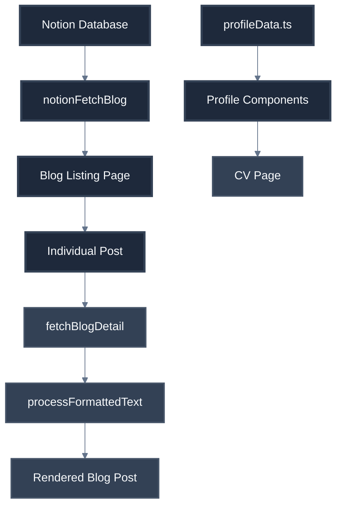

# Codebase Summary: Yuda Blog

## Project Structure Overview

### Core Application (`src/app/`)
```
src/app/
├── layout.tsx           # Root layout with navigation and footer
├── page.tsx             # Home page with profile overview
├── globals.css          # Global styles and Tailwind configuration
├── profile/
│   └── page.tsx         # CV/Portfolio page with terminal design
├── blog/
│   ├── page.tsx         # Blog listing page with Notion integration
│   ├── loading.tsx      # Loading states for blog pages
│   ├── notion-fetch-blog.tsx # Notion API client utility
│   └── [title]/
│       └── page.tsx     # Dynamic blog post detail page
└── api/
    ├── check-updates/   # API route for checking content updates
    └── revalidate/      # API route for manual revalidation
```

### Component Architecture (`src/components/`)

#### Atomic Design Pattern Implementation

**Atoms** (`src/components/atoms/`)
- `ProfileName.tsx` - Displays formatted name with terminal styling
- `ProfileTitle.tsx` - Job title/role component with animations
- `TechTag.tsx` - Technology skill tags with color coding
- `TerminalButton.tsx` - Button component mimicking terminal interface

**Molecules** (`src/components/molecules/`)
- `CommandLine.tsx` - Terminal command line interface
- `ContactJSON.tsx` - Contact information in JSON format
- `ProjectItem.tsx` - Individual project showcase component
- `SkillItem.tsx` - Skill display with proficiency indicators
- `TerminalBar.tsx` - Terminal window header bar

**Organisms** (`src/components/organisms/`)
- `TerminalHeader.tsx` - Complete terminal header with controls
- `SkillsSection.tsx` - Skills showcase section
- `TimelineSection.tsx` - Career timeline component
- `ProjectsSection.tsx` - Projects portfolio section

### Data Layer (`src/data/`)
- `profileData.ts` - Static profile data structure with CV content

### Type Definitions (`src/components/types/`)
- `profile.ts` - TypeScript interfaces for profile/CV components

## Key Features Implemented

### 1. Blog System
| Component | Purpose | Status |
|-----------|---------|--------|
| **Blog Listing** | Displays all blog posts from Notion | ✅ Implemented |
| **Blog Detail** | Individual blog post rendering | ✅ Implemented |
| **Notion Integration** | Fetches content from Notion CMS | ✅ Implemented |
| **ISR Support** | Incremental Static Regeneration | ✅ Implemented |

### 2. Profile System
| Component | Purpose | Status |
|-----------|---------|--------|
| **CV Page** | Complete professional portfolio | ✅ Implemented |
| **Terminal Design** | Terminal-themed UI components | ✅ Implemented |
| **Atomic Components** | Reusable UI building blocks | ✅ Implemented |
| **Print Optimization** | PDF-friendly styling | ✅ Implemented |

### 3. Technical Infrastructure
| Feature | Implementation | Status |
|---------|----------------|--------|
| **Next.js 15** | App Router with React 19 | ✅ Active |
| **TypeScript** | Strict type checking | ✅ Active |
| **Tailwind CSS** | Utility-first styling | ✅ Active |
| **Dark Mode** | System preference support | ✅ Active |
| **Responsive Design** | Mobile-first approach | ✅ Active |

## Core Functions

### Notion Integration
```typescript
// Primary blog fetching function
notionFetchBlog(): Promise<TypeNotionBlogs[]>
- Fetches blog posts from Notion database
- Filters by release date
- Returns structured blog data

// Individual blog post fetching
fetchBlogDetail(title: string): Promise<BlogDetail | null>
- Fetches specific blog post content
- Handles rich text formatting
- Processes Notion blocks to HTML
```

### Content Processing
```typescript
// Rich text processing
processFormattedText(text: string): string
- Converts Notion rich text to HTML
- Handles code blocks, headings, lists
- Applies Tailwind CSS classes

// Color class mapping
getColorClass(color: string): string
- Maps Notion colors to Tailwind classes
- Supports dark mode variants
```

### Component Data Flow


## Performance Features

### Caching Strategy
| Level | Implementation | Revalidation |
|-------|----------------|--------------|
| **Build Time** | Static generation for blog posts | On deployment |
| **Runtime** | ISR with 5-minute revalidation | 300 seconds |
| **API Routes** | Built-in Next.js caching | Manual triggers |

### Bundle Optimization
- Tree-shaking enabled for icon libraries
- Dynamic imports for heavy components
- Image optimization with Next.js Image component
- Font optimization with Google Fonts

## Environment Configuration

### Required Environment Variables
```bash
NOTION_TOKEN=secret_xxx...           # Notion integration token
NOTION_DATABASE_ID=abc123...         # Blog posts database ID
NEXT_PUBLIC_SITE_URL=https://...     # Production URL
```

### Development Configuration
```json
{
  "scripts": {
    "dev": "next dev --turbopack",    # Development with Turbopack
    "build": "next build",            # Production build
    "start": "next start",            # Production server
    "lint": "next lint"               # ESLint checking
  }
}
```

## Dependencies Summary

### Core Dependencies
| Package | Version | Purpose |
|---------|---------|---------|
| `next` | 15.2.4 | React framework |
| `react` | ^19.0.0 | UI library |
| `@notionhq/client` | ^2.3.0 | Notion API client |
| `tailwindcss` | ^4 | Styling framework |
| `typescript` | ^5 | Type safety |

### UI/UX Dependencies
| Package | Purpose |
|---------|---------|
| `@heroicons/react` | Icon library |
| `developer-icons` | Technology icons |
| `react-syntax-highlighter` | Code highlighting |
| `moment` | Date formatting |

## File Relationships

### Critical Path Dependencies
1. **Blog Flow**: `notion-fetch-blog.tsx` → `blog/page.tsx` → `blog/[title]/page.tsx`
2. **Profile Flow**: `profileData.ts` → `components/atoms/*` → `profile/page.tsx`
3. **Layout Flow**: `layout.tsx` → all pages (global navigation/footer)

### Component Dependencies
```
TerminalHeader (organism)
├── TerminalBar (molecule)
│   └── TerminalButton (atom)
└── CommandLine (molecule)
    └── ProfileName (atom)

SkillsSection (organism)
├── SkillItem (molecule)
│   └── TechTag (atom)
└── ProjectItem (molecule)
```

## Known Limitations & Considerations

### Current Constraints
1. **Notion Rate Limits**: 3 requests/second limitation handled with caching
2. **Build Dependencies**: No root-level TypeScript compilation
3. **Image Optimization**: External images require domain configuration
4. **Error Handling**: Limited error boundaries implementation

### Future Extensibility Points
1. **Search Functionality**: Ready for implementation with blog data structure
2. **Analytics**: Pre-configured with Next.js analytics integration
3. **Comments System**: Blog detail pages ready for comment integration
4. **Newsletter**: Email capture forms can be added to layout