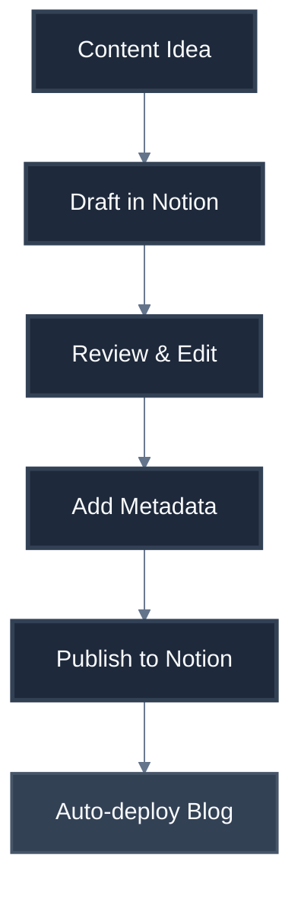

# Product Context: Yuda Blog

## Why This Blog Exists

This blog serves as a personal platform to share technical insights, document learning experiences, and establish thought leadership in software engineering. It addresses the need for a modern, fast, and maintainable blogging solution that leverages contemporary web technologies.

## Problems It Solves

| Problem | Solution |
|---------|----------|
| **Slow static site generators** | Next.js 15 with App Router for optimal performance |
| **Complex content management** | Notion as intuitive headless CMS |
| **Poor mobile experience** | Responsive design with Tailwind CSS |
| **SEO challenges** | Built-in Next.js SEO optimizations |
| **Developer experience gaps** | TypeScript for type safety and better DX |

## How It Should Work

### Content Creation Flow

### User Experience Goals

| Goal | Implementation |
|------|----------------|
| **Fast Loading** | Static generation + CDN |
| **Smooth Reading** | Clean typography, dark mode |
| **Easy Navigation** | Intuitive routing, search |
| **Mobile First** | Responsive design |
| **Accessible** | WCAG 2.1 compliance |

## Target Audience

- **Primary**: Software engineers and technical professionals
- **Secondary**: Students learning web development
- **Tertiary**: Tech recruiters and hiring managers

## Content Strategy

### Content Types
- Technical tutorials and guides
- Project case studies
- Industry insights and opinions
- Tool reviews and comparisons

### Publishing Workflow

## Success Metrics

| Metric | Target |
|--------|--------|
| Page Load Time | < 1 second |
| Lighthouse Score | > 95 |
| Mobile Usability | 100% |
| Content Freshness | Weekly updates |
| User Engagement | 3+ min avg session |
