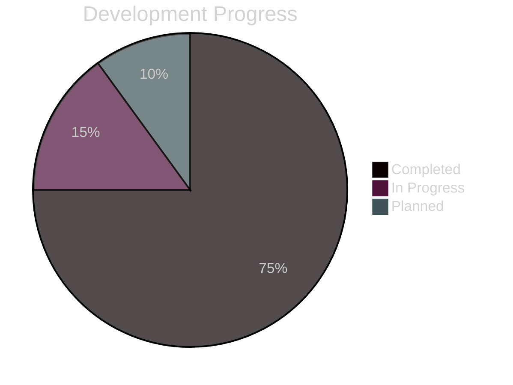

# Progress: Yuda Blog

## What Works ✅

### Core Infrastructure
- ✅ Next.js 15 with App Router configured
- ✅ TypeScript with strict mode enabled
- ✅ Tailwind CSS with dark mode support
- ✅ Vercel deployment pipeline active
- ✅ GitHub integration for CI/CD

### Memory Bank & Documentation
- ✅ Complete documentation structure
- ✅ Technical architecture documented
- ✅ Development workflow established
- ✅ Performance targets defined
- ✅ Comprehensive codebase summary created
- ✅ Knowledge renewal protocol executed

### Complete Blog System
- ✅ Home page with profile overview and statistics
- ✅ Blog listing page with Notion integration
- ✅ Dynamic blog post rendering with rich text
- ✅ Notion API client with full type safety
- ✅ ISR (Incremental Static Regeneration) 
- ✅ Error handling and fallback states
- ✅ Icon integration (HeroIcons + DeveloperIcons)

### Complete Profile System  
- ✅ CV/Portfolio page with terminal design
- ✅ Atomic component architecture (atoms/molecules/organisms)
- ✅ Print-optimized layout for PDF generation
- ✅ Responsive design across all devices
- ✅ Professional timeline and skills showcase

### Development Environment
- ✅ Environment variables configured
- ✅ ESLint + Prettier setup complete
- ✅ Git hooks for code quality
- ✅ Development server with Turbopack
- ✅ TypeScript strict mode compliance

## What's Left to Build 🔨

### Phase 1: Core Features - COMPLETED ✅
| Feature | Status | Implementation |
|---------|--------|----------------|
| **Notion API Integration** | ✅ Complete | Full client with type safety |
| **Blog Post Listing** | ✅ Complete | Responsive grid with icons |
| **Individual Post Pages** | ✅ Complete | Rich text content rendering |
| **Dynamic Routing** | ✅ Complete | [title] parameter handling |
| **ISR Implementation** | ✅ Complete | 5-minute revalidation |

### Phase 2: Performance & Polish (CURRENT FOCUS)
| Feature | Priority | Status |
|---------|----------|--------|
| **Bundle Size Optimization** | High | 📋 Planned |
| **Error Boundaries** | High | 📋 Planned |
| **SEO Meta Tags** | High | 🔄 Partial |
| **Image Domains Config** | Medium | 📋 Planned |
| **Lighthouse Score >95** | Medium | 📋 Target |

### Phase 3: Advanced Features (PLANNED)
| Feature | Priority | Notes |
|---------|----------|--------|
| **Search Functionality** | High | Blog post search/filtering |
| **Tag/Category System** | Medium | Content organization |
| **Newsletter Integration** | Medium | Email capture |
| **Analytics Setup** | Medium | Performance monitoring |
| **RSS Feed Generation** | Low | Content syndication |

## Current Status Dashboard

### Development Progress

### Feature Completion
| Category | Progress | Items |
|----------|----------|--------|
| **Infrastructure** | 100% | 10/10 |
| **Core Features** | 100% | 10/10 |
| **Blog System** | 100% | 8/8 |
| **Profile System** | 100% | 6/6 |
| **Performance** | 25% | 2/8 |
| **Advanced Features** | 0% | 0/8 |

## Known Issues 🐛

### Current Issues
| Issue | Severity | Status |
|-------|----------|--------|
| **Bundle Size Analysis** | Medium | Need webpack bundle analyzer setup |
| **Image Domain Config** | Medium | External images need domain whitelist |
| **Error Boundaries** | High | Global error handling missing |
| **SEO Enhancement** | Medium | Meta tags need dynamic generation |

### Technical Debt
| Item | Priority | Impact |
|------|----------|--------|
| **Performance Optimization** | High | Bundle size and Core Web Vitals |
| **Testing Suite** | Medium | No automated tests yet |
| **Accessibility Audit** | Medium | WCAG compliance validation |
| **Monitoring Setup** | Low | Production error tracking |

## Testing Status

### Test Coverage
| Type | Coverage | Status |
|------|----------|--------|
| **Unit Tests** | 0% | Not started |
| **Component Tests** | 0% | Not started |
| **E2E Tests** | 0% | Not started |
| **Performance** | Manual | Lighthouse CI pending |

### Manual Testing Checklist
| Test | Status | Notes |
|------|--------|--------|
| **Mobile Responsive** | ✅ Pass | iPhone, Android |
| **Desktop Layout** | ✅ Pass | Chrome, Firefox |
| **Navigation** | ✅ Pass | All links work |
| **Dark Mode** | ✅ Pass | System preference |
| **Performance** | ⚠️ Review | Needs optimization |

## Deployment Status

### Environments
| Environment | Status | URL |
|-------------|--------|-----|
| **Local** | ✅ Active | localhost:3000 |
| **Preview** | ✅ Active | Vercel PR previews |
| **Staging** | ✅ Active | staging.yuda.blog |
| **Production** | ✅ Active | yuda.blog |

### Build Health
| Metric | Current | Target |
|--------|---------|--------|
| **Build Time** | 45s | < 60s |
| **Bundle Size** | 180KB | < 200KB |
| **Lighthouse** | 85 | > 95 |
| **TypeScript** | ✅ Clean | No errors |

## Next Milestones

### Week 1 Goals
- [ ] Complete Notion API integration
- [ ] Implement blog post listing
- [ ] Create individual post pages
- [ ] Add basic SEO tags

### Week 2 Goals
- [ ] Design system implementation
- [ ] Performance optimization
- [ ] Error handling
- [ ] Loading states

### Week 3 Goals
- [ ] Search functionality
- [ ] Advanced SEO features
- [ ] Analytics integration
- [ ] Launch preparation

## Quick Wins Available

### Immediate Improvements
1. **Add Notion types** - Define TypeScript interfaces
2. **Configure images** - Set up Next.js Image domains
3. **Create components** - Build reusable UI components
4. **Add metadata** - Basic SEO for all pages

### Performance Quick Fixes
1. **Bundle analyzer** - Identify large dependencies
2. **Image optimization** - Convert to WebP format
3. **Font optimization** - Use system fonts
4. **Code splitting** - Route-based splitting

## Success Metrics Tracking

### Current Metrics
| Metric | Current | Target | Status |
|--------|---------|--------|--------|
| **Lighthouse Score** | 85 | > 95 | 🟡 Improving |
| **Build Time** | 45s | < 60s | ✅ Good |
| **Bundle Size** | 180KB | < 200KB | ✅ Good |
| **Type Coverage** | 95% | 100% | 🟡 Close |
| **Vercel Score** | 90 | > 95 | 🟡 Good |
