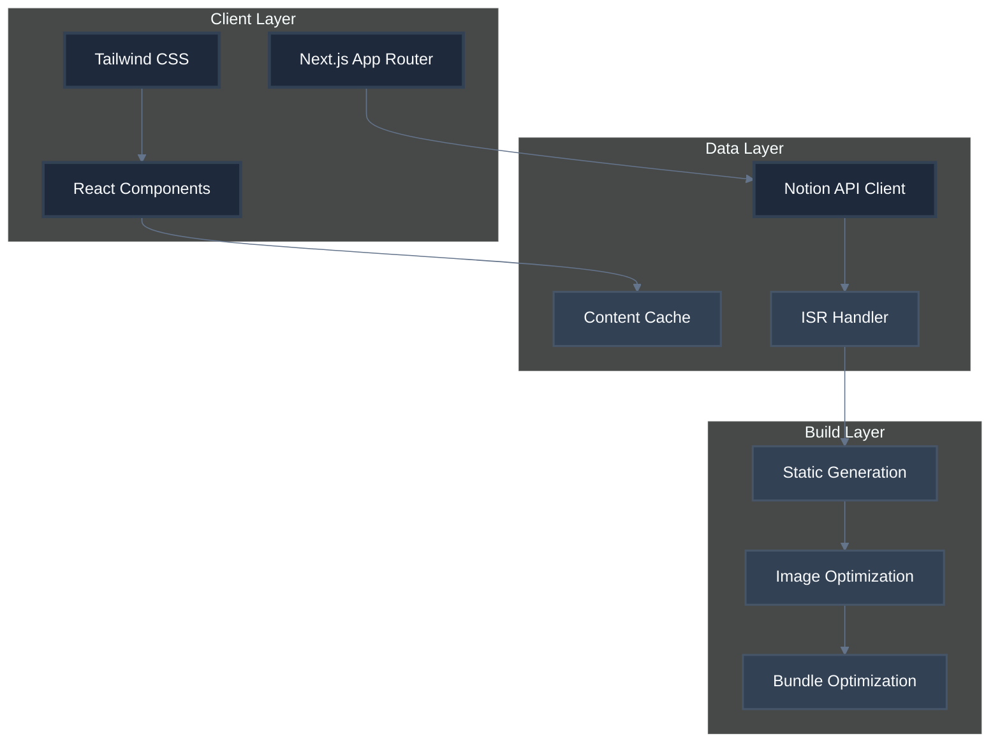
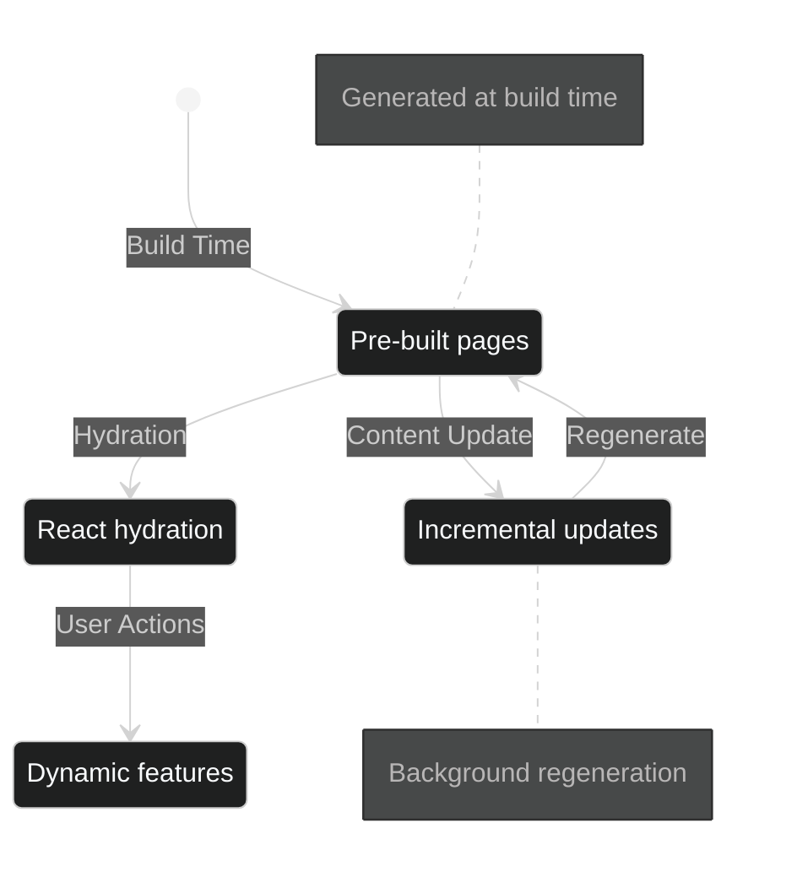
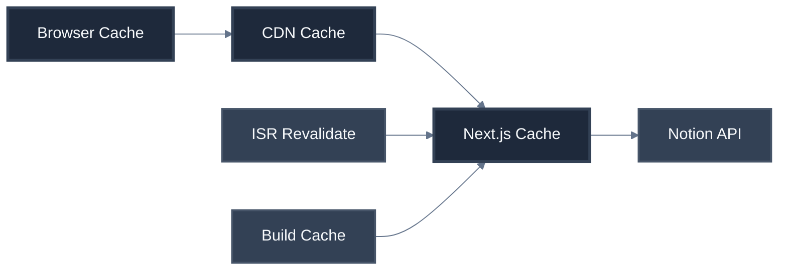

# System Patterns: Yuda Blog

## Architecture Overview

### Core Architecture Pattern
The blog follows a **Static Site Generation (SSG)** pattern with **Incremental Static Regeneration (ISR)** for optimal performance and content freshness.

### Component Architecture


## Design Patterns

### 1. Component Composition Pattern
- **Atomic Design**: Components organized as atoms, molecules, organisms
- **Compound Components**: Related UI elements grouped together
- **Render Props**: Flexible component behavior customization

### 2. Data Fetching Patterns
| Pattern | Use Case | Implementation |
|---------|----------|----------------|
| **Static Generation** | Blog posts, pages | `generateStaticParams()` |
| **ISR** | Content updates | `revalidate` option |
| **Client Fetching** | Dynamic content | SWR for caching |
| **Server Components** | Initial page load | React Server Components |

### 3. State Management


## File Structure Patterns

### Directory Organization
```
src/
├── app/                    # App Router
│   ├── blog/              # Blog routes
│   ├── api/               # API routes
│   └── globals.css        # Global styles
├── components/            # React components
│   ├── ui/               # Reusable UI components
│   ├── layout/           # Layout components
│   └── blog/             # Blog-specific components
├── lib/                  # Utilities and helpers
│   ├── notion/          # Notion integration
│   ├── utils/           # General utilities
│   └── types/           # TypeScript types
└── public/              # Static assets
```

### Naming Conventions
| Type | Pattern | Example |
|------|---------|---------|
| **Components** | PascalCase | `BlogCard.tsx` |
| **Utilities** | camelCase | `formatDate.ts` |
| **Types** | PascalCase with suffix | `BlogPost.type.ts` |
| **CSS Classes** | kebab-case | `blog-card` |
| **API Routes** | kebab-case | `blog-posts.ts` |

## Performance Patterns

### 1. Image Optimization
- Next.js Image component for automatic optimization
- WebP format with fallbacks
- Responsive image sizing
- Blur placeholders for better UX

### 2. Code Splitting
- Route-based splitting with App Router
- Component-level lazy loading
- Dynamic imports for heavy components

### 3. Caching Strategy


## Security Patterns

### 1. API Security
- Environment variables for sensitive data
- Rate limiting on API routes
- Input validation and sanitization
- CORS configuration

### 2. Content Security
- Content Security Policy (CSP) headers
- XSS prevention measures
- Secure headers configuration

## Error Handling Patterns

### 1. Error Boundaries
- Global error boundary for the app
- Route-specific error handling
- Graceful degradation for API failures

### 2. User Feedback
| Error Type | User Experience | Technical Response |
|------------|-----------------|-------------------|
| **404 Not Found** | Custom 404 page | Log and redirect |
| **500 Server Error** | Friendly error page | Error boundary |
| **API Failures** | Fallback content | Retry mechanism |
| **Network Issues** | Offline indicator | Service worker |
