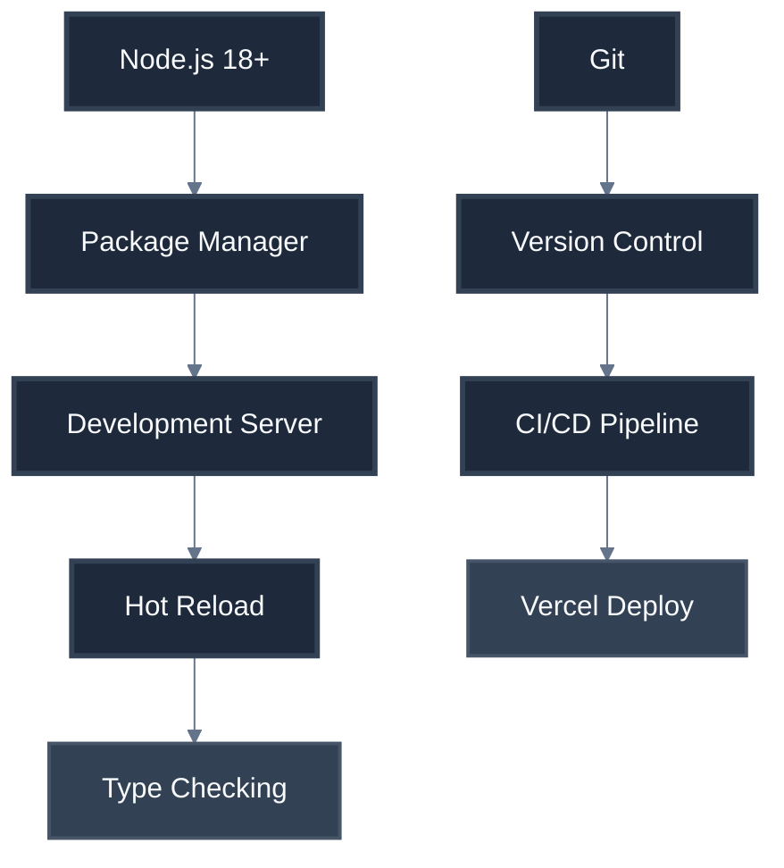

# Technical Context: Yuda Blog

## Technology Stack

### Core Technologies
| Technology | Version | Purpose |
|------------|---------|---------|
| **Next.js** | 15.x | React framework with App Router |
| **TypeScript** | 5.x | Type safety and better DX |
| **Tailwind CSS** | 3.x | Utility-first styling |
| **Notion API** | Latest | Headless CMS integration |
| **Vercel** | Latest | Hosting and deployment |

### Development Dependencies
| Package | Version | Purpose |
|---------|---------|---------|
| **@notionhq/client** | 2.x | Notion API client |
| **lucide-react** | Latest | Icon library |
| **clsx** | Latest | Conditional CSS classes |
| **tailwind-merge** | Latest | Merge Tailwind classes |

## Development Environment

### System Requirements

### Environment Setup
| Variable | Purpose | Example |
|----------|---------|---------|
| `NOTION_TOKEN` | Notion API access | `secret_xxx...` |
| `NOTION_DATABASE_ID` | Blog posts database | `abc123...` |
| `NEXT_PUBLIC_SITE_URL` | Production URL | `https://yuda.blog` |

## Technical Constraints

### Performance Constraints
- **Bundle Size**: < 200KB initial JS
- **Image Size**: < 100KB per image (optimized)
- **API Response**: < 500ms for Notion calls
- **Build Time**: < 60 seconds

### Browser Support
| Browser | Minimum Version |
|---------|-----------------|
| **Chrome** | 90+ |
| **Firefox** | 88+ |
| **Safari** | 14+ |
| **Edge** | 90+ |

### API Limitations
| Limit | Value | Strategy |
|-------|-------|----------|
| **Notion Rate Limit** | 3 req/sec | Caching + batching |
| **Vercel Function Timeout** | 30s | Optimize queries |
| **Build Timeout** | 45min | Incremental builds |

## Development Workflow

### Local Development Setup

### Build Process
| Step | Tool | Purpose |
|------|------|---------|
| **Type Checking** | TypeScript | Compile-time errors |
| **Linting** | ESLint | Code quality |
| **Formatting** | Prettier | Consistent style |
| **Optimization** | Next.js | Production build |
| **Deployment** | Vercel | Edge deployment |

## Testing Strategy

### Testing Tools
| Tool | Purpose | Coverage Target |
|------|---------|-----------------|
| **Jest** | Unit tests | 80% |
| **React Testing Library** | Component tests | 70% |
| **Playwright** | E2E tests | Critical paths |
| **Lighthouse CI** | Performance | > 95 score |

### Test Environments
| Environment | URL | Purpose |
|-------------|-----|---------|
| **Local** | `localhost:3000` | Development |
| **Preview** | Vercel preview | PR reviews |
| **Staging** | staging.yuda.blog | Pre-production |
| **Production** | yuda.blog | Live site |

## Monitoring & Analytics

### Performance Monitoring
| Tool | Metric | Alert Threshold |
|------|--------|-----------------|
| **Vercel Analytics** | Core Web Vitals | LCP < 2.5s |
| **Lighthouse CI** | Performance score | > 95 |
| **Bundle Analyzer** | Bundle size | < 200KB |

### Error Tracking
| Service | Purpose | Integration |
|---------|---------|-------------|
| **Vercel Logs** | Server errors | Built-in |
| **Console Logs** | Client errors | Browser dev tools |
| **Performance** | Core metrics | Web Vitals API |
